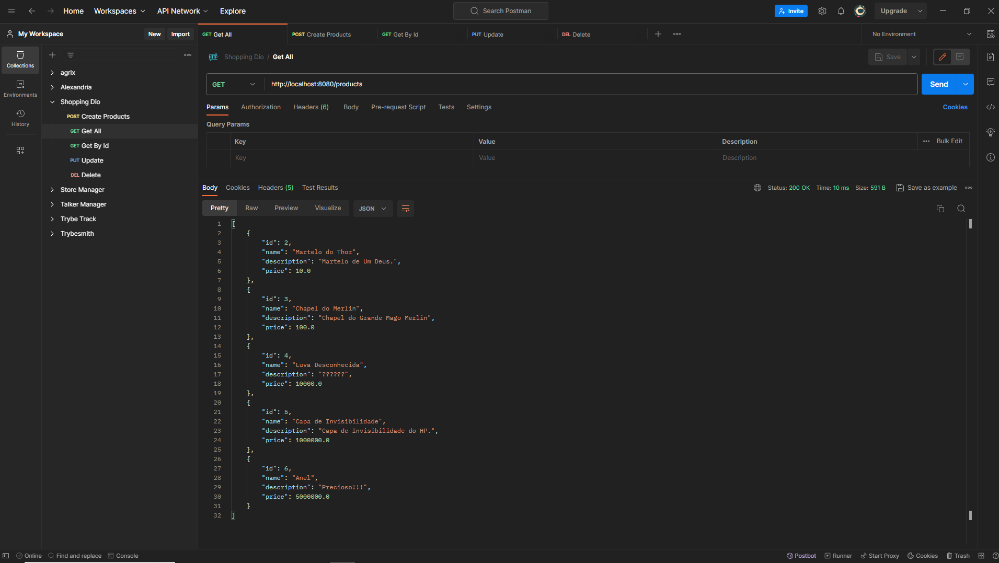

# Shoppin Dio



# Índice

* [Título e Imagens Home](#shoppin-dio)
* [tecnologias utilizadas](#tecnologias-utilizadas)
* [Descrição do projeto](#descrição-do-projeto)
* [Status do Projeto](#status-do-projeto)
* [Funcionalidade do projeto](#🔨-funcionalidade-do-projeto)
* [Acesso ao Projeto](#acesso-ao-projeto)

# Tecnologias utilizadas


# Descrição do Projeto

O projeto "Shoppin Dio"  é projeto do BootCamp Santander Bootcamp 2023 - Fullstack Java+Angular da Dio. Nesse projeto, os alunos têm a oportunidade de aplicar seus conhecimentos no na Linguagem Java e no Famework Spring Boot 

# Status do Projeto

> 💹 Alpha 💹

# 🔨 Funcionalidade do projeto

- Criar novo Produto
- Lista os Produtos
- Busca Por um Produto
- Atualizar um Produto
- Deletar um Produto

# Acesso ao projeto

Para acessar e executar este projeto, siga os passos abaixo:

1. Certifique-se de ter o Node.js e o npm instalados em sua máquina.

2. Clone o Projeto

```bash
git clone  ShoppingDio
```

3. Entre no projeto

```bash
cd ShoppingDio
```

4. Instale as Dependências

O Intellij instala automaticamente.

Caso esteja com outra Ide

```bash
mvn install
```


5. inicie o projeto

Execute a Classe AppApplication.

# Rotas

<details>
<summary><strong>Get All Products</strong></summary>

method ```GET```

Rota

```bash
http://localhost:8080/products
```

</details>


<details>
<summary><strong>Create Product</strong></summary>

method ```POST```

Rota

```bash
http://localhost:8080/products
```

Corpo da Requisição

```bash
{
  "name": "Martelo do Thor",
  "price": 10,
  "description": "Martelo de Um Deus."
}
```

</details>

<details>
<summary><strong>Update Product</strong></summary>

method ```PUT```

Rota

```bash
http://localhost:8080/products/1
```

Corpo da Requisição

```bash
{
  "name": "Mjolnir",
  "price": 10,
  "description": "Martelo de Um Deus."
}
```

</details>

<details>
<summary><strong>Get By Product Id</strong></summary>

method ```GET```

Rota

```bash
http://localhost:8080/products/1
```

</details>

<details>
<summary><strong>Delete</strong></summary>

method ```DELETE```

Rota

```bash
http://localhost:8080/products/1
```

</details>

